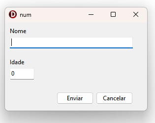
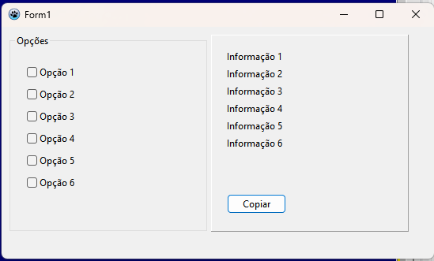
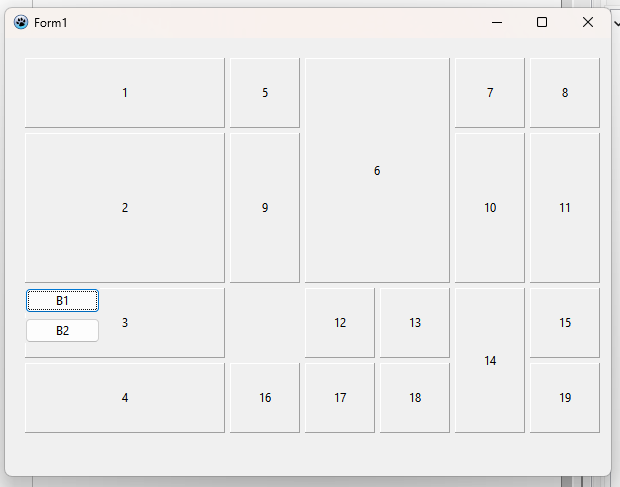
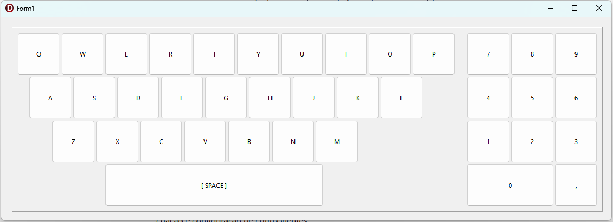

# OPCB – Object Pascal Component Builder  

**Versão em português**: veja [README_PT.md](README_PT.md)

---

🚀 Instantiate and configure Delphi and Lazarus components in a fluent, expressive, and reusable way.  

**OPCB (Object Pascal Component Builder)** is a library that simplifies runtime component creation in **Delphi** and **Lazarus**, allowing you to build and configure visual components with a fluent, clear, and organized API.  

---

## 📖 Documentation
Documentation: [docs/doc.md](docs/doc.md)
---

## ✨ Benefits  

- 🔹 **Fluent API** – Configure properties and events in a chained way.  
- 🔹 **Less repetitive code**.
- 🔹 **Hierarchical organization** – Facilitates creation of nested layouts.  
- 🔹 **Automatic grid support** – Add controls in cells with `RowSpan` and `ColSpan`.  
- 🔹 **Compatible with VCL, LCL, and FMX** . 

---

## 🚀 Usage Examples  

Simple control creation:  

```pascal
uses
  OPCB;

procedure TForm1.FormCreate(Sender: TObject);
var
  Creator: TControlCreator;
begin
  Creator := TControlCreator.Create;
  try
    Creator
      .WithOwnerAndParent(Self, Self)
      .SetSpace(5, 5)
      .SetTopLeft(10, 10)
      .SetDirection(cpdVertical)
      .Add(TControlBuilder.Create(TLabel).WithCaption('Nome'))
      .Add(TControlBuilder.Create(TEdit, 'edit_name').WithWidth(250).WithCaption(''))
      .IncTop(15)
      .Add(TControlBuilder.Create(TLabel).WithCaption('Idade'))
      .Add(TControlBuilder.Create(TNumberBox).WithWidth(50))
      .IncTop(20)
      .SetDirection(cpdHorizontal)
      .Add(TControlBuilder.Create(TButton, 'button_enviar').WithCaption('Enviar'))
      .Add(TControlBuilder.Create(TButton, 'button_cancelar').WithCaption('Cancelar'))
      .AlignControlsRight(['button_enviar', 'button_cancelar'], ['edit_name'])
    ;
  finally
    Creator.Free;;
  end;
end;
```


---

Nested control creation:  

```pascal
uses
  OPCB;

procedure TForm1.FormCreate(Sender: TObject);
var
  Creator: TControlCreator;
begin
  Creator := TControlCreator.Create;
  try
    Creator
      .WithOwnerAndParent(Self, Self)
      .SetTopLeft(10, 10)
      .SetSpace(5, 5)
      .SubLevel(TControlBuilder.Create(TGroupBox).WithCaption('Opções').WithWidthAndHeight(250, 250))
        .SetDirection(cpdVertical)
        .SetTopLeft(20, 20)
        .Add(TControlBuilder.Create(TCheckBox).WithCaption('Opção 1'))
        .Add(TControlBuilder.Create(TCheckBox).WithCaption('Opção 2'))
        .Add(TControlBuilder.Create(TCheckBox).WithCaption('Opção 3'))
        .Add(TControlBuilder.Create(TCheckBox).WithCaption('Opção 4'))
        .Add(TControlBuilder.Create(TCheckBox).WithCaption('Opção 5'))
        .Add(TControlBuilder.Create(TCheckBox).WithCaption('Opção 6'))
      .SuperLevel
      .SubLevel(TControlBuilder.Create(TPanel).WithWidthAndHeight(250, 250))
        .SetDirection(cpdVertical)
        .SetTopLeft(20, 20)
        .Add(TControlBuilder.Create(TLabel).WithCaption('Informação 1'))
        .Add(TControlBuilder.Create(TLabel).WithCaption('Informação 2'))
        .Add(TControlBuilder.Create(TLabel).WithCaption('Informação 3'))
        .Add(TControlBuilder.Create(TLabel).WithCaption('Informação 4'))
        .Add(TControlBuilder.Create(TLabel).WithCaption('Informação 5'))
        .Add(TControlBuilder.Create(TLabel).WithCaption('Informação 6'))
        .IncTop(50)
        .Add(TControlBuilder.Create(TButton).WithCaption('Copiar'))
      .SuperLevel
    ;
  finally
    Creator.Free;
  end;
end;  

```


---

Grid Mode:  

```pascal
uses
  OPCB;

procedure TForm1.FormCreate(Sender: TObject);
var
  Creator: TControlCreator;
begin
  Creator := TControlCreator.Create;
  try
    Creator
      .WithOwnerAndParent(Self, Self)
      .SetTopLeft(20, 20)
      .SetSpace(5, 5)
      .SetDirection(cpdVertical)
      .GridInit(4, 6)
        .GridSetCellWidthAndHeight(70, 70)
        .GridSetColWidth(0, 200)
        .GridSetRowHeight(1, 150)
        .Add(TControlBuilder.Create(TPanel).WithCaption('1'))
        .Add(TControlBuilder.Create(TPanel).WithCaption('2'))
        .SubLevel(TControlBuilder.Create(TPanel).WithCaption('3'))
          .Add(TControlBuilder.Create(TButton).WithCaption('B1'))
          .Add(TControlBuilder.Create(TButton).WithCaption('B2'))
        .SuperLevel
        .Add(TControlBuilder.Create(TPanel).WithCaption('4'))
        .Add(TControlBuilder.Create(TPanel).WithCaption('5'))
        .SetDirection(cpdHorizontal)
        .GridColSpan(2)
        .GridRowSpan(2)
        .Add(TControlBuilder.Create(TPanel).WithCaption('6'))
        .Add(TControlBuilder.Create(TPanel).WithCaption('7'))
        .Add(TControlBuilder.Create(TPanel).WithCaption('8'))
        .Add(TControlBuilder.Create(TPanel).WithCaption('9'))
        .Add(TControlBuilder.Create(TPanel).WithCaption('10'))
        .Add(TControlBuilder.Create(TPanel).WithCaption('11'))
        .GridSkipCell
        .Add(TControlBuilder.Create(TPanel).WithCaption('12'))
        .Add(TControlBuilder.Create(TPanel).WithCaption('13'))
        .GridRowSpan(2)
        .Add(TControlBuilder.Create(TPanel).WithCaption('14'))
        .Add(TControlBuilder.Create(TPanel).WithCaption('15'))
        .Add(TControlBuilder.Create(TPanel).WithCaption('16'))
        .Add(TControlBuilder.Create(TPanel).WithCaption('17'))
        .Add(TControlBuilder.Create(TPanel).WithCaption('18'))
        .Add(TControlBuilder.Create(TPanel).WithCaption('19'))
      .GridFinish
    ;
  finally
    Creator.Free;
  end;
end;   
```



## 🚀 Example: Building a Virtual Keyboard

The example below demonstrates how to build a complete **virtual keyboard** using the library.

```pascal
procedure TForm1.FormCreate(Sender: TObject);
var
  Creator: TControlCreator;
begin
  Creator := TControlCreator.Create;
  try
    Creator
      .WithOwnerAndParent(Self, Self)
      .SetSpace(2, 2)
      .SetTopLeft(20, 20)
      .SubLevel(TControlBuilder.Create(TPanel))
        .SetTopLeft(10, 10)
        .GridInit(4, 10)
          .GridSetCellWidthAndHeight(80, 80)
          .GridSetRowOffset(1, 22)
          .GridSetRowOffset(2, 65)
          .External(procedure (ACreator: TControlCreator)
            const KeyRows: array[0..1] of string = ('QWERTYUIOPASDFGHJKL', 'ZXCVBNM');
            var Key: Char;
            begin
              for Key in KeyRows[0] do
                ACreator.Add(TControlBuilder.Create(TSpeedButton).WithCaption(Key));
              ACreator.Break;
              for Key in KeyRows[1] do
                ACreator.Add(TControlBuilder.Create(TSpeedButton).WithCaption(Key));
              ACreator.Break;
              ACreator.GridSkipCells(2);
              ACreator.GridColSpan(5);
              ACreator.Add(TControlBuilder.Create(TSpeedButton).WithCaption('[ SPACE ]'));
            end
          )
        .GridFinish
        .IncLeft(20)
        .GridInit(4, 3)
          .GridSetCellWidthAndHeight(80, 80)
          .External(procedure(ACreator: TControlCreator)
            const Keys = '789456123';
            var Key: Char;
            begin
              for Key in Keys do
                ACreator.Add(TControlBuilder.Create(TSpeedButton).WithCaption(Key));
              ACreator.GridColSpan(2);
              ACreator.Add(TControlBuilder.Create(TSpeedButton).WithCaption('0'));
              ACreator.Add(TControlBuilder.Create(TSpeedButton).WithCaption(','));
            end
          )
        .GridFinish
        .RecalcParentSize(10, 10)
      .SuperLevel
    ;
  finally
    Creator.Free;
  end;
end;
```


---

## 🔑 Features Demonstrated

- **Fluent control creation**
  - `.WithOwnerAndParent(Self, Self)` defines owner and parent.
  - `.SetSpace(2, 2)` / `.SetTopLeft(20, 20)` control spacing and initial position.

- **Hierarchy of levels**
  - `.SubLevel(...)` opens a new construction scope (e.g. a `TPanel`).
  - `.SuperLevel` returns to the previous level.

- **Grid layouts**
  - `.GridInit(Cols, Rows)` starts a grid.
  - `.GridSetCellWidthAndHeight(W, H)` defines the cell dimensions.
  - `.GridSetRowOffset(Row, Offset)` applies offset in specific rows.

- **Dynamic control insertion**
  - `.External(procedure(ACreator: TControlCreator) ...)`  
    allows batch creation of controls such as keys from arrays/strings.

- **Grid positioning control**
  - `.Break` → line/column break.  
  - `.GridSkipCells(N)` → skips cells.  
  - `.GridColSpan(N)` → merges columns (e.g. **SPACE** key).

- **Automatic container adjustment**
  - `.RecalcParentSize(PaddingX, PaddingY)` automatically resizes the parent container.

---

## 🎹 Result

The example creates:

- A **QWERTY keyboard** with two letter rows and an expanded **[ SPACE ]** key.  
- A **numeric keyboard** with digits `0–9` and a comma.  
- Both organized within a `TPanel` that automatically adjusts to its content.


---

## 🧩 Installation

### 🔹 Option 1 – Clone the repository

```bash
git clone https://github.com/fabianoallex/opcb-object-pascal-component-builder.git
```

### 🔹 Option 2 – Manual download

Download the ZIP file from the GitHub repository and extract it to a folder of your choice.

---

### 💠 Delphi

1. Open **Delphi**.  
2. Go to **Tools ▸ Options ▸ Language ▸ Delphi Options ▸ Library**.  
3. In the **Library Path** field, add the full path to the `src` folder.  
   Example:  
   `C:\opcb\src`

---

### 💠 Lazarus

1. Open **Lazarus**.  
2. Go to **Project ▸ Project Options ▸ Compiler Options ▸ Paths**.  
3. In **Other unit files (-Fu)**, add the path to the `src` folder.  
   Example:  
   `C:\opcb\src`

---

### 🧰 Done!

After that, the project's units will be available for use in your Delphi or Lazarus projects.

---