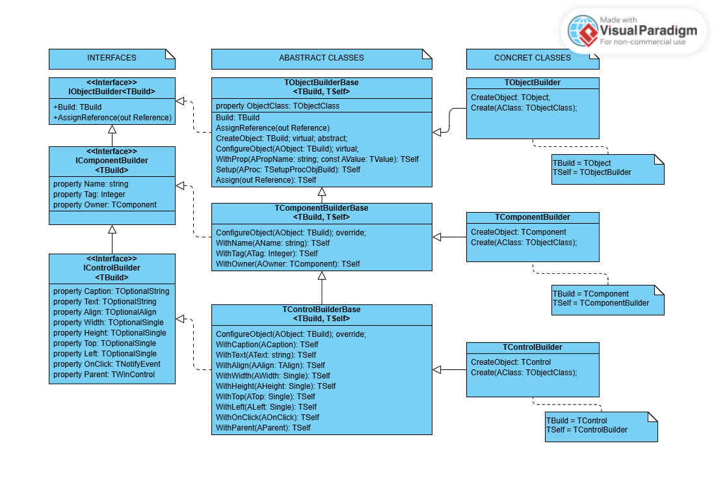

# Documentação

* [Visão geral](#visão-geral)
    * [Sobre a biblioteca](#sobre-a-biblioteca)
    * [Benefícios](#benefícios)
    * [Licença - Direitos autorais](#licença---direitos-autorais)
* [Instalação e configuração](#instalação-e-configuração)
* [Classes e Interfaces](#classes-e-interfaces)
    * [Builders](#builders)
        * [IObjectBuilder](#iobjectbuilder)
            * [TObjectBuilderBase](#tobjectbuilderbase)
            * [TObjectBuilder](#tobjectbuilder)
        * [IComponentBuilder](#icomponentbuilder)
            * [TComponentBuilderBase](#tcomponentbuilderbase)
            * [TComponentBuilder](#tcomponentbuilder)
        * [IMenuBuilder](#imenubuilder)
            * [TMenuBuilderBase](#tmenubuilderbase)
            * [TMenuBuilder](#tmenubuilder)
        * [IMenuItemBuilder](#imenuitembuilder)
            * [TMenuItemBuilderBase](#tmenuitembuilderbase)
            * [TMenuItemBuilder](#tmenuitembuilder)
        * [IControlBuilder](#icontrolbuilder)
            * [TControlBuilderBase](#tcontrolbuilderbase)
            * [TControlBuilder](#tcontrolbuilder)
    * [Creators](#creators)
        * [TComponentCreator](#tcomponentcreator)
        * [TControlCreator](#tcontrolcreator)
        * [TMenuCreator](#tmenucreator)
        * [TControlCreator](#tcontrolcreator-1)
        * [TOPCBCreators](#topcbcreators)


## Visão geral

### Sobre a biblioteca

A OPCB (Object Pascal Component Builder) é uma biblioteca desenvolvida em Object Pascal, criada para simplificar a criação e configuração de componentes visuais e não-visuais em aplicações Delphi e Lazarus.
Seu objetivo é reduzir a complexidade do código, eliminar repetição e fornecer uma abordagem fluente para a construção de componentes, tornando os projetos mais fáceis de manter, escalar e evoluir.

### Benefícios

Uma das principais vantagens da OPCB é permitir a criação de componentes diretamente no código, dispensando o uso de arquivos .dfm (Delphi) ou .lfm (Lazarus). Dessa forma, toda a lógica e configuração dos componentes ficam centralizadas em unidades .pas, o que oferece vários benefícios práticos:

* Compatibilidade entre Delphi e Lazarus: facilita a portabilidade de projetos entre as duas IDEs.
* Substituição de componentes simplificada: permite substituição de Componentes;
* Facilidade de criar novos componentes com base nos existentes sem precisar instalá-los na IDE.
* Redução de conflitos em sistemas de versionamento: evita problemas comuns com arquivos .dfm ou .lfm em repositórios Git.
* Código mais organizado e centralizado: todas as definições de componentes e layouts ficam em um único lugar, facilitando manutenção e revisão.

Em resumo, a OPCB torna o desenvolvimento de interfaces mais rápido, consistente e confiável, oferecendo flexibilidade e controle total sobre a criação de componentes.

---

### Licença - Direitos autorais

A OPCB (Object Pascal Component Builder) é distribuída sob a Apache License, Version 2.0 (Janeiro de 2004).

Isso significa que você pode usar, modificar e distribuir a biblioteca livremente, inclusive em projetos comerciais, desde que respeite os seguintes pontos:

1. **Notificação de copyright e licença**
    * Todos os arquivos da biblioteca devem manter a indicação de copyright e a referência à licença.
2. **Redistribuição de modificações**
    * Se você alterar a biblioteca e redistribuí-la, deve informar as mudanças realizadas.
3. **Sem garantias**
    * A biblioteca é fornecida “no estado em que se encontra”, sem qualquer garantia de funcionamento ou responsabilidade por danos.

**Recursos adicionais**

Você pode consultar o texto completo da licença no arquivo LICENSE do repositório.

A licença permite tanto uso em projetos open source quanto proprietários, oferecendo flexibilidade máxima para integração em diferentes contextos.

---

### Instalação e configuração

#### 🔹 Opção 1 – Clonar o repositório

```bash
git clone https://github.com/fabianoallex/opcb-object-pascal-component-builder.git
```

#### 🔹 Opção 2 – Download manual

Baixe o arquivo ZIP do repositório no GitHub e extraia o conteúdo em uma pasta de sua preferência.


#### 💠 Delphi

1. Abra o **Delphi**.  
2. Vá em **Tools ▸ Options ▸ Language ▸ Delphi Options ▸ Library**.  
3. No campo **Library Path**, adicione o caminho completo da pasta `src`.  
   Exemplo:  
   `C:\opcb\src`


#### 💠 Lazarus

1. Abra o **Lazarus**.  
2. Vá em **Project ▸ Project Options ▸ Compiler Options ▸ Paths**.  
3. Em **Other unit files (-Fu)**, adicione o caminho da pasta `src`.  
   Exemplo:  
   `C:\opcb\src`

### 🧰 Pronto!

Após isso, as units do projeto estarão disponíveis para uso em seus projetos Delphi ou Lazarus.

---

### Classes e Interfaces

#### Builders

Builders são classes utilizadas para a instanciação de objetos.




##### IObjectBuilder

Interface base que define as operações de construção de objetos genéricos.

| Método | Retorno | Descrição |
|--------|----------|------------|
| `Build: TBuild` | `TBuild` | Cria e retorna uma nova instância do tipo genérico `TBuild`. |
| `AssignReference(var AReference: TBuild)` | `void` | Atribui a instância criada por `Build` à variável informada. |


#### TObjectBuilderBase<TBuild, TSelf>

Classe abstrata que implementa a interface *IObjectBuilder\<TBuild\>*
 e fornece a infraestrutura principal para construção de objetos no padrão Builder.
É responsável por criar, configurar e preparar instâncias do tipo genérico TBuild, permitindo o uso de métodos fluentes e operações de configuração customizadas.


| Método | Retorno | Descrição |
|--------|----------|------------|
CreateObject: TBuild; virtual; abstract;|TBuild|Método abstrato a ser implementado pelas classes derivadas. Deve criar uma nova instância através do construtor definido em ObjectClass. 
ConfigureObject(AObject: TBuild); virtual;||Atribui as propriedades definidas pelo builder ao objeto instanciado após o build. Deve ser sobrescrito pelas classes que estendem TObjectBuilderBase, mas sempre chamando **inherited ConfigureObject(AObject);**.
ApplyPropPath(Instance: TObject; AProp: TPropertyValue); ||	Aplica ao objeto instanciado com Build um valor de propriedade via RTTI usando caminho hierárquico ('Prop.SubProp'). Exemplo: 'Font.Size'.
ApplyPendindProps(Instance: TObject);	||Aplica ao objeto instanciado com Build todas as propriedades pendentes armazenadas em FProperties via RTTI.
SetupProc(AProcObj: TSetupProcObj<TBuild>); overload;||Adiciona uma referencia a um procedimento de configuração de objeto definido pelo usuário. Procedimento será executado durante a execução do método build.
SetupProc(ARefProc: TSetupRefProc<TBuild>); overload;||Adiciona uma referencia a um procedimento de configuração de objeto definido pelo usuário. Procedimento será executado durante a execução do método build.
Create; overload;	||Construtor.
Create(AClass: TObjectClass); overload;	||Construtor que recebe como parâmetro a classe a ser instanciada.
Create(AClass: TObjectClass; out Reference); overload;	||Construtor que recebe como parâmetro a classe a ser instanciada. Recebe também como parâmetro uma referência de uma variável para receber a instância criada.
Destroy; override;	||Destrutor.
AssignReference(out Reference);	||Atribui o objeto criado por build ao parâmetro recebido. Mantém a referencia em uma lista.
ResetReferences;	||Limpa lista de referências.
Assign(out Reference): TSelf; overload;	|TSelf|Atribui a referência e retorna a própria instância para uso fluente.
WithProp(const APropName: string; const AValue: TValue): TSelf; overload;	|TSelf|Define o valor de uma propriedade simples via RTTI.
WithProp(const APropValue: TPropertyValue): TSelf; overload;	|TSelf|Define uma propriedade do objeto via RTTI usando um registro TPropertyValue.
WithPropObj(const APropName: string; AObj: TObject): TSelf; overload;	|TSelf|Define uma propriedade do objeto via RTTI de tipo objeto.
WithPropSet(const APropName: string; const AValue: Integer): TSelf;	|TSelf|Define uma propriedade de tipo set do objeto via RTTI.
Setup(AProc: TSetupProcObjBuild): TSelf; overload;	|TSelf|Adiciona um procedimento de configuração de objeto.
Setup(AProc: TSetupRefProcBuild): TSelf; overload;	|TSelf|Adiciona um procedimento de configuração de objecto.
Build: TBuild; |TBuild	|Cria, configura e retorna o objeto final do tipo TBuild.
property ObjectClass:	TObjectClass	||Retorna a classe associada à construção atual.


##### TObjectBuilder

Classe concreta que herda TObjectBuilderbase. Define tipo genérico TBuild como TComponent.

Exemplo de uso:

```pascal
uses
  OPCB;
  
type
  TMyClass = class
  private
    FBar: string;
    FFoo: Integer;
    procedure SetBar(const Value: string);
    procedure SetFoo(const Value: Integer);
  published
    property Foo: Integer read FFoo write SetFoo;
    property Bar: string read FBar write SetBar;
  end;

procedure TForm1.FormCreate(Sender: TObject);
var
  Builder: TObjectBuilder;
  MyObject: TMyClass;
begin
  Builder := TObjectBuilder.Create(TMyClass);

  try
    MyObject := Builder
      .WithProp('Foo', 10)
      .WithProp('Bar', 'bar')
      .Build as TMyClass;
  finally
    Builder.Free;
  end;

  with MyObject do
    ShowMessage(Format('%d - %s', [Foo, Bar]));
end;
```

#### TObjectBuilder

Classe concreta que herda de *TObjectBuilderBase<TObject, TObjectBuilder>*.

Fornece uma implementação genérica para construção de instâncias de TObject, permitindo criar objetos de qualquer classe derivada de TObject sem a necessidade de definir um tipo genérico específico.

É útil como builder universal para cenários onde o tipo concreto do objeto é determinado em tempo de execução.

Herança

    TObjectBuilder = class(TObjectBuilderBase<TObject, TObjectBuilder>)


| Método | Retorno | Descrição |
|--------|----------|------------|
CreateObject: TObject; override;|TObject|Cria uma nova instância do tipo TObject com base na classe definida em FObjectClass. Este método sobrescreve a implementação abstrata da classe base.
Create; overload;||Cria uma nova instância de TObjectBuilder associada à classe TObject.
Create(out Reference); overload;||Cria uma nova instância e atribui a referência do objeto construído à variável fornecida.
Create(AClass: TObjectClass); overload;	||Inicializa o builder associando-o a uma classe específica de objeto (TObjectClass).
Create(AClass: TObjectClass; out Reference); overload;	||Cria uma instância associada a uma classe e já atribui a referência de saída.


#### IComponentBuilder<TBuild>

A interface *IComponentBuilder\<TBuild\>* estende *IObjectBuilder\<TBuild\>*
 e define as operações específicas para construção de componentes (TComponent e descendentes).

Ela adiciona suporte ao gerenciamento de propriedades comuns de componentes — como Name, Owner e Tag —, permitindo que o processo de criação seja totalmente controlado de forma fluente e consistente.

Herança

    IComponentBuilder<TBuild> = interface(IObjectBuilder<TBuild>)

| Propriedade | Tipo | Descrição |
|--------|----------|------------|
Name|string|Define o nome do componente, equivalente à propriedade Name do TComponent.
Tag|	NativeInt|	Define o valor do identificador livre (Tag) associado ao componente.
Owner|TComponent|Define ou obtém o componente responsável por gerenciar o ciclo de vida do componente construído.

Métodos

| Propriedade | Tipo | Descrição |
|--------|----------|------------|
GetName: string;|string|Retorna o nome a ser atribuído ao objeto a ser instanciado 
SetName(AValue: string);||Define o nome do componente a ser instanciado pelo Build.
GetTag: NativeInt;	|NativeInt|Retorna o valor da propriedade Tag a ser atribuída ao objeto instanciado.
SetTag(AValue: NativeInt);||Define o valor da propriedade Tag do objeto a ser instanciado.
GetOwner: TComponent;|TComponent|Retorna o Owner associado ao componente a ser instanciado.
SetOwner(AValue: TComponent);||Define o Owner responsável pelo ciclo de vida do componente a ser instanciado.


#### TComponentBuilderBase<TBuild, TSelf>

Classe abstrata que estende *TObjectBuilderBase<TBuild, TSelf>*
 e implementa a interface *IComponentBuilder\<TBuild\>*.

Serve como base para todos os builders voltados à criação e configuração de componentes (TComponent e descendentes), adicionando suporte a propriedades típicas como Name, Owner e Tag.

Além disso, *TComponentBuilderBase* mantém a fluência dos métodos herdados da classe base (*TObjectBuilderBase*), preservando o retorno do tipo genérico TSelf.
Isso permite encadear chamadas entre os métodos herdados e os métodos específicos de componentes, garantindo uma experiência fluente, por exemplo:

```pascal
Builder
  .WithName('BtnOk')
  .WithTag(10)
  .WithProp('Caption', 'Confirmar')
  .Setup(SetupProc)
  .Build;
```

Herança

    TComponentBuilderBase<TBuild, TSelf> = class(TObjectBuilderBase<TBuild, TSelf>, IComponentBuilder<TBuild>)

Campos protegidos
| Propriedade | Tipo | Descrição |
|--------|----------|------------|
FName	|string|	Armazena o nome do componente.
FTag	|NativeInt|	Armazena o valor de identificação livre do componente.
FOwner	|TComponent|	Armazena o componente que será o owner da instância criada.

Métodos protegidos
| Propriedade | Descrição |
|----------|------------|
ConfigureObject(AObject: TBuild); override;|	Executa a configuração adicional do componente após sua criação, aplicando Name, Tag e Owner conforme definidos.

Métodos públicos
| Método | Tipo | Descrição |
|--------|----------|------------|
Create(AClass: TComponentClass; const AName: string=''); overload;	||Construtor. Cria o builder para um tipo de componente e opcionalmente define o nome inicial.
Create(AClass: TComponentClass; const AName: string; out Reference); overload;	||Construtor. Cria o builder para um tipo de componente, define o nome e atribui a referência do objeto criado.
Create(AClass: TComponentClass; out Reference); overload;	||Construtor. Cria o builder e atribui a referência sem definir o nome.
GetName: string;	||Retorna o nome atual configurado para o componente.
GetOwner: TComponent;	||Retorna o owner atualmente associado ao componente.
GetTag: NativeInt;	||Retorna o valor atual configurado para a propriedade Tag.
SetName(AValue: string);	||Define o nome do componente que será atribuído durante a construção.
SetOwner(AValue: TComponent);	||Define o owner responsável pelo ciclo de vida do componente.
SetTag(AValue: NativeInt);	||Define o valor da propriedade Tag do componente.
WithName(AName: string): TSelf;||	Define o nome do componente e retorna a própria instância (método fluente).
WithTag(ATag: NativeInt): TSelf;||	Define o valor da propriedade Tag e retorna a própria instância (método fluente).

Propriedades
| Propriedade | Tipo | Descrição |
|--------|----------|------------|
Name	|string|	Nome do componente a ser criado.
Tag|	NativeInt|	Valor numérico associado ao componente.
Owner	|TComponent|	Componente owner responsável pela instância criada.

#### TComponentBuilder

A classe *TComponentBuilder* é uma especialização concreta da classe genérica *TComponentBuilderBase*, projetada para facilitar a criação de instâncias de TComponent (ou de qualquer descendente) de forma fluente e configurável.

Ela oferece construtores sobrecarregados que permitem:

* Criar o componente sem nome nem referência.
* Criar o componente com nome definido.
* Criar o componente atribuindo automaticamente a instância a uma variável externa.

O método protegido CreateObject é sobrescrito para realizar a instanciação efetiva do componente, utilizando o tipo informado no construtor.

Assim como as demais classes Builder da biblioteca, TComponentBuilder mantém a fluência herdada dos métodos da classe base (TComponentBuilderBase), permitindo encadeamento de chamadas com retorno do tipo TSelf.

Isso significa que métodos herdados e específicos podem ser combinados livremente, proporcionando uma construção legível e expressiva.

| Construtor | Descrição |
|--------|------------|
Create|	Cria o builder sem parâmetros, utilizando como classe a ser instanciada TComponent.
Create(AClass: TComponentClass; const AName: string = '')|	Cria o builder para a classe informada, opcionalmente definindo o nome do componente.
Create(AClass: TComponentClass; const AName: string; out Reference)|Cria o builder e atribui a instância criada à variável Reference.
Create(AClass: TComponentClass; out Reference)	|Cria o builder atribuindo a instância criada à variável Reference, sem definir nome.

Método
| Propriedade | Tipo | Descrição |
|--------|----------|------------|
CreateObject: TComponent|TComponent|Sobrescreve o método base para instanciar o componente informado em AClass.